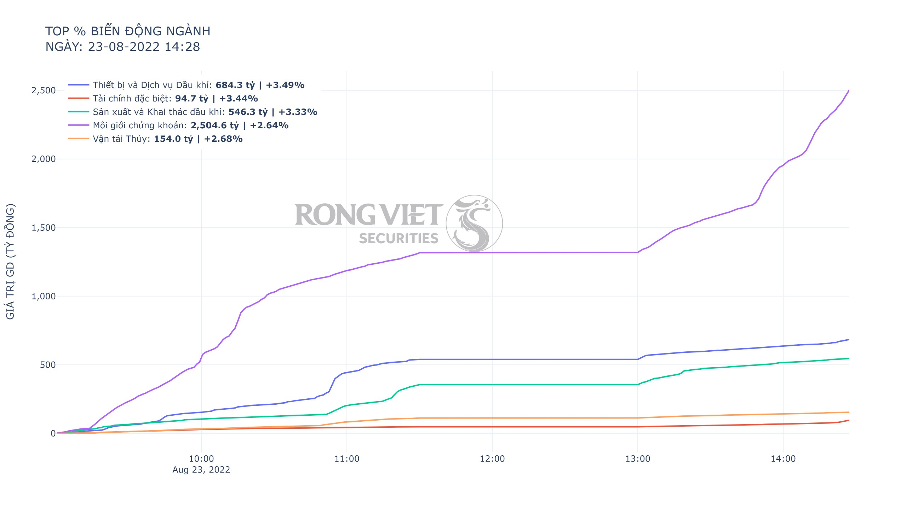
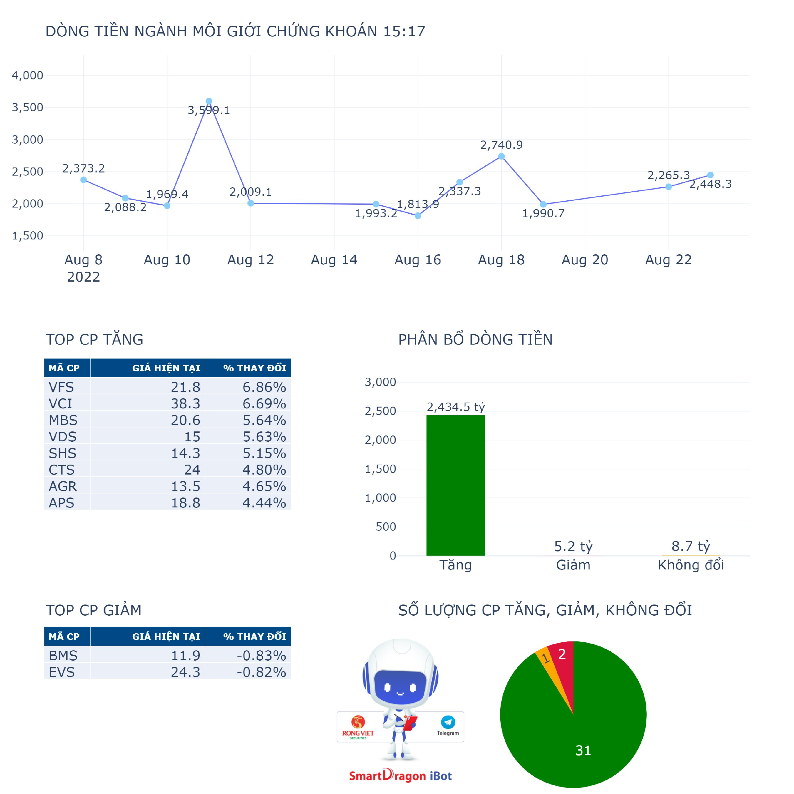

# 🔥 Nhóm lệnh liên quan đến ngành

<mark style="color:blue;">**/nganhtop**</mark> : Dùng để thống kê top 5 ngành có %thay đổi giá đóng cửa chỉ số hiện tại so với ngày hôm qua

<figure><figcaption></figcaption></figure>


Dữ liệu được vẽ với tần suất 5 phút/lần trong suốt phiên giao dịch


<mark style="color:blue;">**/manganh**</mark> : Dùng để lấy ICB Code và tên ngành phân ngành cấp 4 của tất cả các ngành hiện có

<mark style="color:blue;">**/nganh**</mark> _**ICBCode**_ : Dùng để vẽ tỷ trọng giá trị giao dịch của ngành so với giá trị giao dịch toàn thị trường


Ví dụ: <mark style="color:blue;">/nganh</mark> 1353 3353 3357 3577 8777 9537 3355

**Lưu ý:** cần có khoảng trắng giữa các ngành

Lệnh này admin trực tiếp truy vấn trên SmartDragon iBot Group không truy vấn trên group


<figure><figcaption></figcaption></figure>


* <mark style="color:green;">**Chấm xanh lá cây**</mark>: Biểu thị chỉ số ngành ngày hôm đó tăng so với ngày hôm trước.
* <mark style="color:red;">**Chấm đỏ**</mark>: thể hiện chỉ số ngành ngày hôm đó giảm so với ngày hôm trước
* <mark style="color:purple;">**Trục y1**</mark>: thể hiện tỷ lệ % Giá trị giao dịch của ngành/Giá trị giao dịch toàn thị trường
* <mark style="color:purple;">**Trục y2**</mark>: thể hiện giá trị giao dịch toàn thị trường tính theo đơn vị Tỷ đồng


<mark style="color:blue;">**/maICBCode**</mark> : Thống kê thông tin ngành

Ví dụ: <mark style="color:blue;">**/8777**</mark> : Ngành môi giới chứng khoán


Có thể dùng lệnh <mark style="color:blue;">**/manganh**</mark> để tra cứu mã của các ngành có trong iBot Group



**Dùng để thống kê các thông tin sau của ngành:**

* Tổng dòng tiền
* Dòng tiền tích cực - Dòng tiền tiêu cực
* Số lượng các cổ phiếu Tăng - Giảm - Không đổi
* Top các cổ phiếu Tăng - Giảm


<figure><figcaption></figcaption></figure>

<mark style="color:blue;">**/nn 5d**</mark>: Thống kê top 10 ngành được khối ngoại mua bán trong 5 phiên (Lưu ý: d là day, khi thay đổi chỉ số, số phiên thống kê sẽ thay đổi tương ứng, người dùng có thể nhập nn 1d, nn 5d, nn 7d,...tùy ý)

<mark style="color:blue;">**/nn 1m**</mark>: Thống kê top 10 ngành được khối ngoại mua bán trong 1 tháng (Lưu ý: m là month, khi thay đổi chỉ số, số tháng thống kê sẽ thay đổi tương ứng, người dùng có thể nhập nn 1m, nn 3m, nn 7m,...tùy ý)
