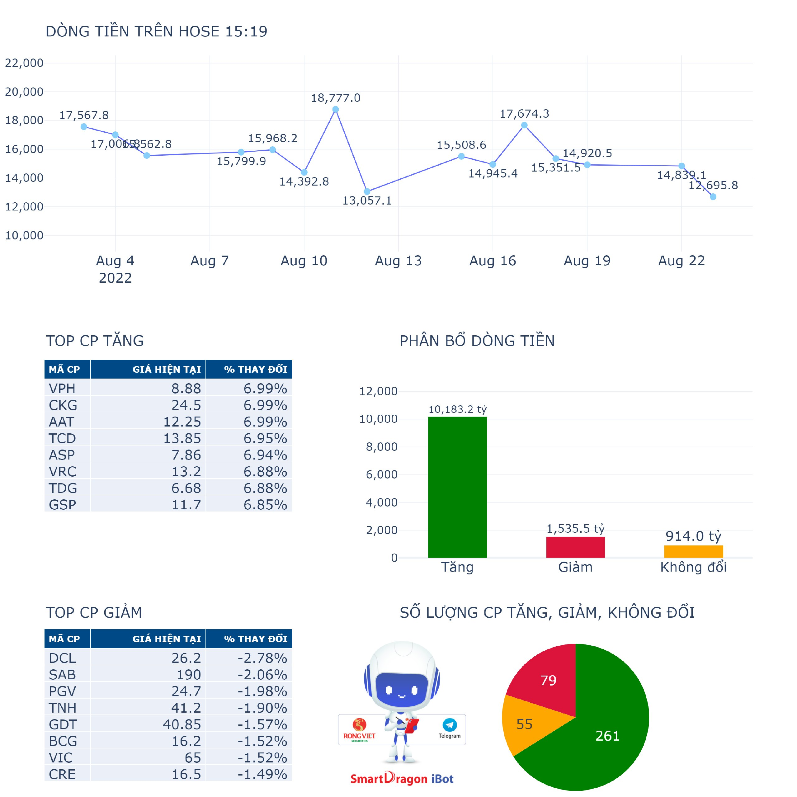
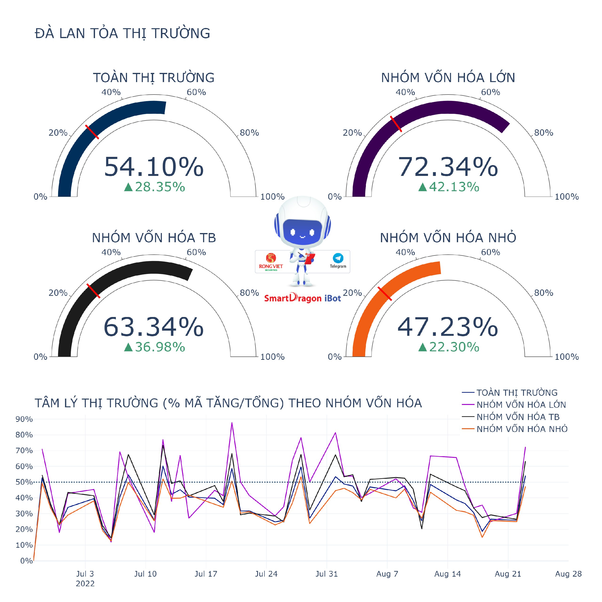
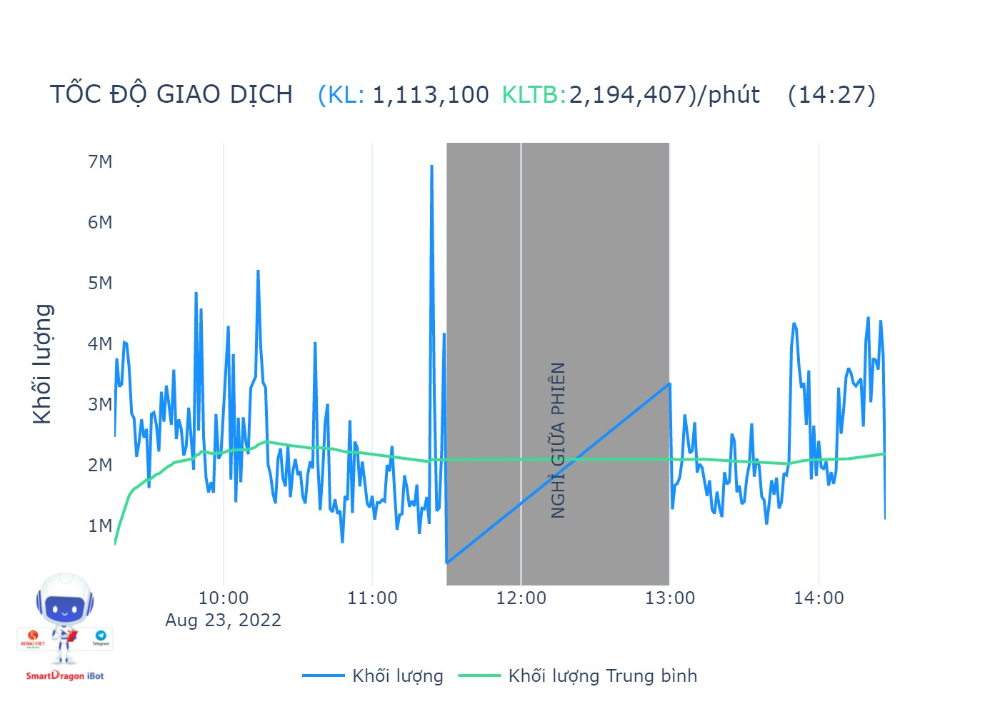
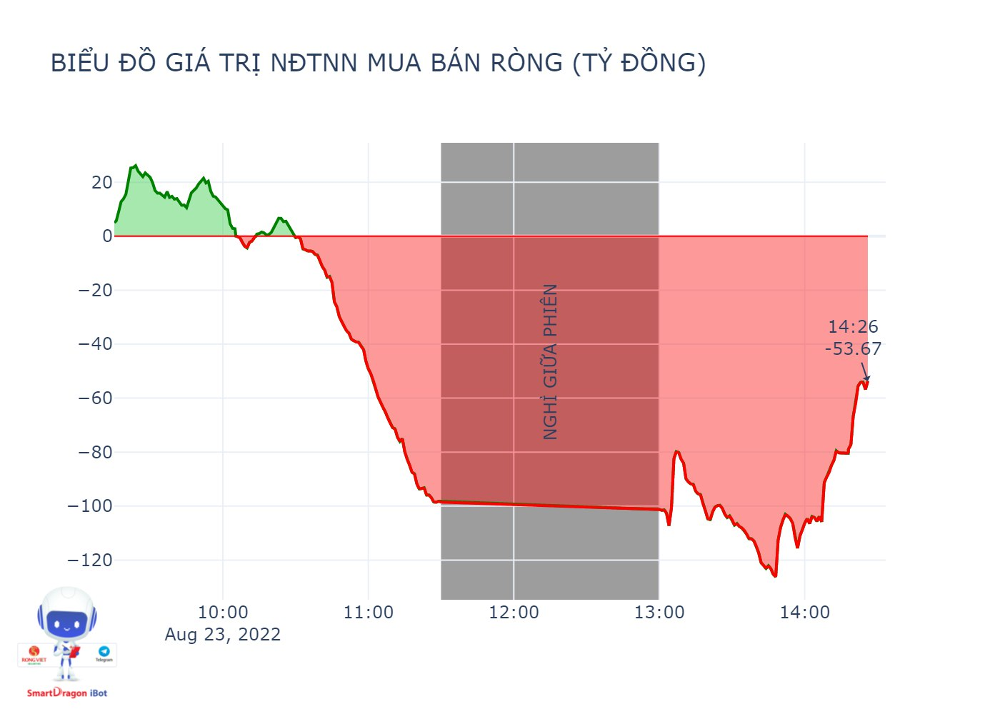
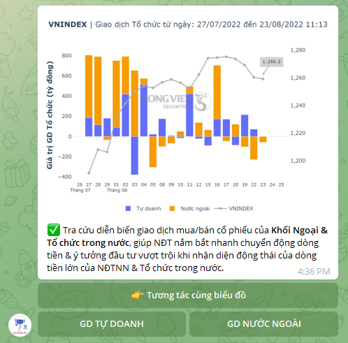

# 💎 Nhóm lệnh liên quan đến thị trường

* <mark style="color:blue;">**/hose**</mark>
* <mark style="color:blue;">**/hnx**</mark>
* <mark style="color:blue;">**/upcom**</mark>


**Dùng để thống kê các thông tin sau trên 3 sàn:**

* Tổng dòng tiền
* Dòng tiền tích cực - Dòng tiền tiêu cực
* Số lượng các cổ phiếu Tăng - Giảm - Không đổi
* Top các cổ phiếu Tăng - Giảm


<figure><figcaption></figcaption></figure>

<mark style="color:blue;">**/dalantoa**</mark>** :** Thống kê tỷ lệ cổ phiếu tăng/tổng số lượng cổ phiếu của thị trường. \
Và Tỷ lệ cổ phiếu tăng/tổng số lượng cổ phiếu phân theo nhóm vốn hóa

<figure><figcaption></figcaption></figure>

<mark style="color:blue;">**/tocdo**</mark> : Thống kê tốc độ khớp lệnh trong phiên giao dịch hiện tại so với tốc độ khớp lệnh trung bình toàn phiên

<figure><figcaption></figcaption></figure>

<mark style="color:blue;">**/nuocngoai**</mark> : Thống kê giá trị giao dịch của khối ngoại trong phiên hiện tại

<figure><figcaption></figcaption></figure>

<mark style="color:blue;">**/tochuc**</mark> : Thống kê giá trị giao dịch nước ngoài và giao dịch tự doanh của Vnindex và Top giao dịch nước ngoài, giao dịch tự doanh

<figure><figcaption></figcaption></figure>
