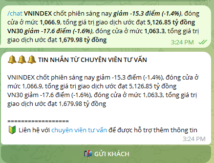

# ✍ Quản lý khách hàng

/<mark style="color:blue;">**chat (nội dung phân tích)**</mark>: Chuyên viên tư vấn nhập nội muốn gửi trên iBot và  gửi đến các khách hàng của mình quản lý

<figure><figcaption></figcaption></figure>

Lưu ý: Chuyên viên cần tạo username cho tài khoản telegram cá nhân, để khách hàng có thể dễ dàng liên hệ bằng cách click vào mục liên hệ với chuyên viên tư vấn.
